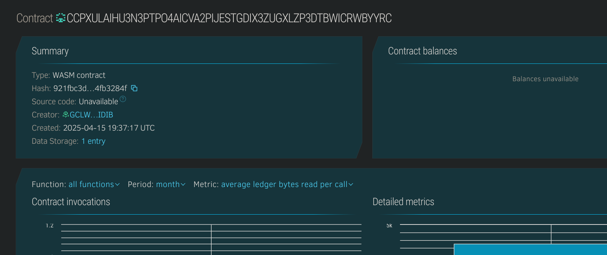

# Crypto Lottery DApp

## Project Title
Crypto Lottery DApp - A decentralized blockchain-based lottery system built on Stellar's Soroban smart contract platform.

## Project Description
Crypto Lottery DApp is a transparent and fair lottery system that leverages blockchain technology to create a trustless environment for lottery participants. Built on Stellar's Soroban platform, this dApp allows users to purchase lottery tickets using cryptocurrency, with all transactions, ticket purchases, and winner selections executed through smart contracts.

The lottery operates in rounds, with each round having a set ticket price. Users purchase tickets, and once the draw occurs, the smart contract randomly selects a winner who receives the entire pot. The transparent nature of blockchain technology ensures that all operations are visible and verifiable by participants, eliminating concerns about fairness that plague traditional lottery systems.

This project demonstrates the power of decentralized applications in creating fair and transparent systems for activities that traditionally require trusted third parties.

## Project Vision
The vision for Crypto Lottery DApp is to revolutionize traditional lottery systems by removing centralized control and introducing absolute transparency and fairness. We aim to:

1. Create a truly decentralized lottery system with no central authority that can manipulate outcomes
2. Provide immediate payouts to winners without delays or administrative overhead
3. Offer lower fees compared to traditional lotteries, allowing more value to flow to participants
4. Build a global lottery system accessible to anyone with internet access and cryptocurrency
5. Demonstrate practical applications of blockchain technology beyond financial transactions
6. Educate users about blockchain technology through an engaging and familiar use case

By achieving these goals, Crypto Lottery DApp will serve as a showcase for how blockchain technology can transform established systems by introducing transparency, efficiency, and global accessibility.

## Key Features

### Current Features:
- **Smart Contract-Based Operations**: All lottery mechanics are executed through immutable smart contracts
- **Transparent Ticket Purchases**: Every ticket purchase is recorded on the blockchain with timestamp and ownership
- **Verifiable Random Selection**: Winner selection uses blockchain-based randomness that cannot be manipulated
- **Automatic Payouts**: Winners receive their prizes directly to their wallet without manual intervention
- **Minimalistic Design**: Simple, focused functionality makes the lottery easy to understand and participate in
- **Low Transaction Fees**: Built on Stellar's efficient blockchain for minimal operational costs
- **Ownership Verification**: Clear proof of ticket ownership stored on the blockchain

### Technical Implementation:
- Built on Stellar's Soroban smart contract platform
- Immutable lottery logic encoded in Rust-based smart contracts
- Stateful contract design for managing lottery rounds and ticket data
- Blockchain-based random number generation for winner selection

## Future Scope

### Short-term Roadmap:
- **Multi-Token Support**: Allow participation using various cryptocurrencies
- **Time-Based Drawings**: Implement automatic drawings based on time intervals
- **Jackpot Accumulation**: Allow partial pot distribution with growing jackpots across rounds
- **UI/UX Improvements**: Build an intuitive web and mobile interface for the lottery
- **Custom Ticket Numbers**: Allow users to select specific numbers for their tickets

### Long-term Vision:
- **DAO Governance**: Transfer control of lottery parameters to a decentralized autonomous organization
- **Multi-Tier Prize Structure**: Implement various prize levels similar to traditional lotteries
- **Cross-Chain Compatibility**: Expand to other blockchain ecosystems
- **Charity Integration**: Option to direct a percentage of the pot to charitable causes
- **Subscription-Based Participation**: Allow users to automatically participate in multiple draws
- **Regulatory Compliance Framework**: Develop tools to help with compliance in various jurisdictions
- **Prediction Market Integration**: Combine lottery mechanics with prediction markets for hybrid gaming experiences
- **Tokenized Lottery Shares**: Allow fractional ownership of large ticket pools

## Contract Details:
CCPXULAIHU3N3PTPO4AICVA2PIJESTGDIX3ZUGXLZP3DTBWICRWBYYRC
